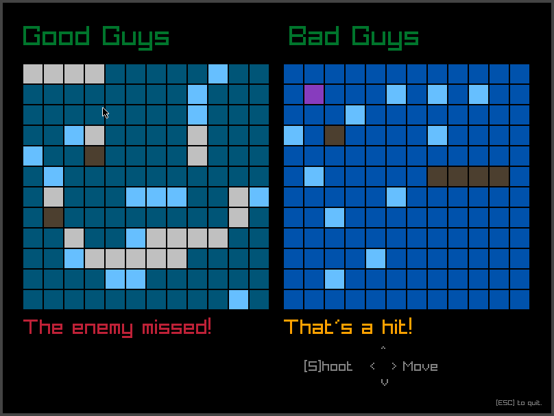
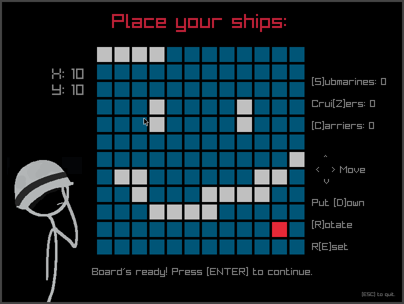

Battleship game made with raylib!
 
This project was made as an assignment for my "programming & algorithms" class.
There are plans to add more complex algorithms for the single-player mode, and
to add a two-player mode too!
 
 
 
 
It has no external dependencies and _should_ run just by executing main.
If you wish to build it, just cd into it and make.
